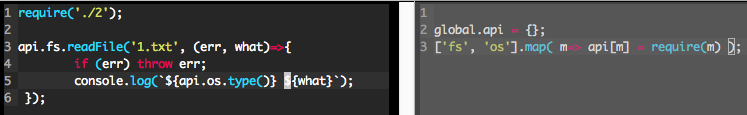
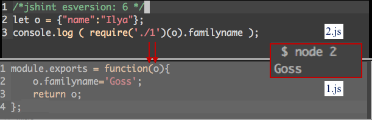

Modules are meant to be isolated from each other. But if they need to use
the same third-party modules?

I basically do not think it's a good idea to share a global namespace from one module to others:

I think we should pass to modules-declared-as-functions like this:

So a module is a function with a formal parameter. We pass to it whatever we need.
And it sees that by the names of its named parameters. Nice.

So in a parent module we require this module and pass to it things like app etc.